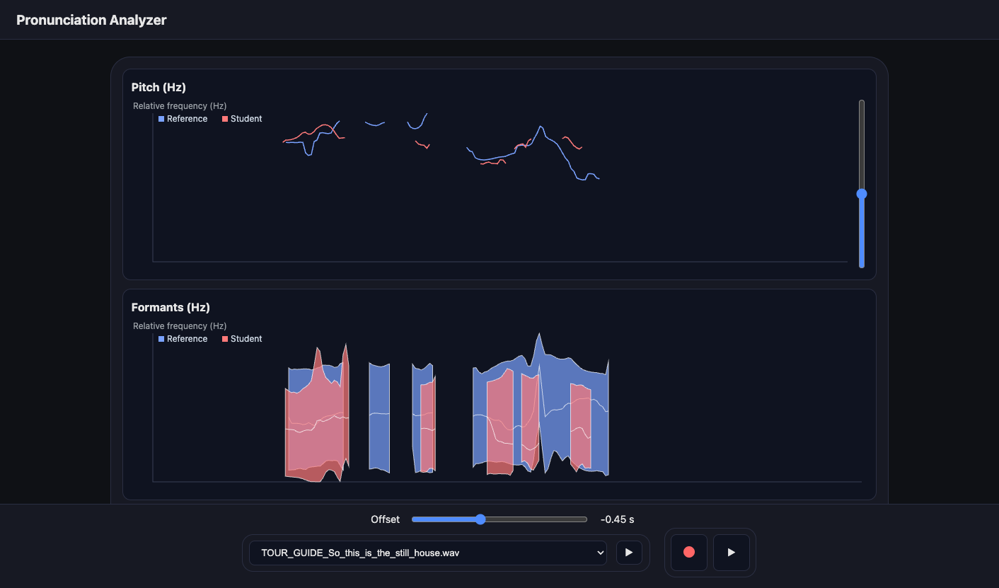

# accents

This web application allows students to compare their pronunciation of sentences with provided baseline recordings, to both improve their accent and help them understand the intricacies of the languages they learn. The application processes student voice recordings and analyzes [pitch](https://en.wikipedia.org/wiki/Pitch_(music)), [formants](https://en.wikipedia.org/wiki/Formant), and [intensity](https://en.wikipedia.org/wiki/Sound_intensity) variations, and displays them in clear graphs that can be played with.

# Credits

This work is based on an idea by Aimee Johansen and Melvil Pfeffer.

This application uses [Parselmouth](https://parselmouth.readthedocs.io), which itself uses the well-known [Praat](https://praat.org), to perform audio processing.

# Funding

This work is carried out as part of language teaching at IMT Atlantique, a leading French technological university. Learn more [here](https://imt-atlantique.fr).

